  

<h1 align="center">⚡ Awesome Streaming Data Platform ⚡</h1>

  <strong>A Curated Ecosystem of Production-Grade SaaS Platforms &amp; Open-Source Distributed Event Streaming Technologies</strong>

  
  
  
  
  
  

---

## 📖 Overview & Ecosystem Landscape

Modern real-time applications, change-data-capture (CDC) pipelines, microservices architectures, and AI event streams require scalable, low-latency, and fault-tolerant streaming infrastructure. This repository provides a comprehensive, benchmarked guide to **SaaS/Hosted Streaming Platforms** and **Open-Source GitHub Projects**.

> 💡 **Topics Covered**: Apache Kafka, Kafka-Compatible Brokers, Apache Pulsar, Apache Flink, Real-Time Stream Processing, S3-Native / Diskless Streaming, Event-Driven Architecture (EDA), and CDC Pipelines.

---

## 📑 Table of Contents

- [☁️ SaaS & Hosted Streaming Platforms](#️-saas--hosted-streaming-platforms)
- [🔥 Open-Source GitHub Projects](#-open-source-github-projects)
- [🏗️ Architectural Categories](#️-architectural-categories)
- [🤝 How to Contribute](#-how-to-contribute)
- [📈 Star History](#-star-history)
- [📜 Disclaimer](#-disclaimer)

---

## ☁️ SaaS & Hosted Streaming Platforms

> 📊 **Market Sizing & Dynamics**: The global Event Streaming and Real-Time Data Platform market is projected to reach **$105B+ by 2030** (growing at an aggressive **~22% CAGR** from ~$28B). The market structure is **moderately concentrated** at the enterprise tier—dominated by cloud hyperscalers (*AWS MSK, Google Cloud Pub/Sub, Azure Event Hubs*) and pioneer *Confluent*, while demonstrating **high fragmentation and rapid innovation** among modern disruptors (*Redpanda, WarpStream, AutoMQ, Aiven, StreamNative, Upstash*) competing on S3-native economics, sub-millisecond latencies, and BYOC architectures.

| 🏢 Platform | 📝 Description | 💰 Company Valuation / Revenue Scale | 🏷️ Starting Pricing | 🎁 Free Tier / Trial Limits |
| :--- | :--- | :--- | :--- | :--- |
| **[Azure Event Hubs](https://azure.microsoft.com/en-us/products/event-hubs)** | Fully managed real-time data ingestion service natively supporting Apache Kafka 1.0+ protocols and AMQP. | **~$3.1 Trillion** *(Microsoft Corp)* | **$0.015 / hour per TU** (1 MB/s in, 2 MB/s out) + **$0.028 per million ingress events** (Basic); Standard tier at **$0.030 / hour / TU** | **100 free concurrent AMQP connections** per namespace; plus **30-Day Free Trial** with **$200 Azure credits** via Azure Free Account |
| **[Google Cloud Pub/Sub](https://cloud.google.com/pubsub)** | Global, fully managed distributed messaging and stream ingestion service with automatic horizontal scaling and multi-zone replication. | **~$2.2 Trillion** *(Alphabet Inc)* | **$40 per TiB** (~$0.04/GB) for throughput above 10 GB; snapshot & message storage at **$0.27 / GB-month** (first 24h free) | **Free Forever Plan**: **10 GB message throughput per month** at $0 + 24-hour message retention storage; plus **90-Day Trial** with **$300 credits** |
| **[Amazon MSK](https://aws.amazon.com/msk/)** | AWS-managed Apache Kafka offering provisioned EC2-backed brokers and Serverless autoscaling with deep IAM and VPC integration. | **~$2.0 Trillion** *(Amazon.com Inc)* | **$0.0456 / broker-hr** (`kafka.t3.small`, 3 brokers min = **$0.1368/hr** / ~$98.50/mo) + $0.10/GB-mo storage; Serverless at **$0.75 / cluster-hr** + $0.10/GB in + $0.05/GB out | **30-Day Free Trial via AWS Free Account**: **$200 in AWS credits** for new accounts (no standalone MSK free tier) |
| **[Instaclustr for Apache Kafka](https://www.instaclustr.com/)** | Enterprise managed Apache Kafka service with SOC 2 compliance, automated operations, and SLA guarantees across AWS, GCP, and Azure. | **~$25 Billion** *(NetApp subsidiary)* | **~$0.09 / node-hour** (~$65/node/month) management fee + underlying cloud provider compute and storage costs | **30-Day Free Trial** with full cluster management access on AWS/GCP/Azure |
| **[Confluent Cloud](https://www.confluent.io/)** | Pioneer cloud-native data streaming platform built by the creators of Kafka, featuring fully managed Apache Flink, Schema Registry, and 120+ pre-built connectors. | **~$7.5 Billion** *(NASDAQ: CFLT / $1B+ ARR)* | **$0.14 / eCKU-hr** (Basic tier; 1st eCKU free) + $0.05/GB data in/out + $0.08/GB-mo storage | **30-Day Free Trial** with **$400 in free credits** across clusters, connectors, and Schema Registry (no credit card required) |
| **[Aiven for Apache Kafka](https://aiven.io/)** | Fully managed Apache Kafka service across AWS, GCP, and Azure with Karapace Schema Registry, REST proxy, and unified multi-cloud console. | **~$3.0 Billion** *(Series D Unicorn)* | **$35 / month** ($0.048/hr) for Developer plan; **$75 / month** ($0.10/hr) for Startup plan | **Free Forever Plan**: 1 Kafka service, 250 KiB/s ingress & egress, up to 5 topics (max 2 partitions/topic), 3-day data retention; plus **30-Day Trial** with **$300 credits** |
| **[Redpanda Cloud](https://www.redpanda.com/)** | High-performance, C++ Kafka-compatible engine with sub-millisecond latency, zero-JVM footprint, and built-in WebAssembly Data Transforms. | **~$750 Million** *(Series C)* | **$0.10 / cluster-hr** + **$0.045 / GB** ingress + **$0.04 / GB** egress + $0.09/GB-mo storage ($0.0015/partition-hr) | **30-Day Free Trial** with **$100 in free credits** ($300 credits via AWS Marketplace; no credit card required) |
| **[StreamNative Cloud](https://streamnative.io/)** | Enterprise cloud-native messaging and streaming powered by Apache Pulsar with native Kafka protocol compatibility (KoP) and Lakehouse streaming. | **~$150 Million** *(Series B)* | **$73 / month** (~$0.10/hr) for Serverless tier + $0.06/GB ingress/egress; BYOC plans from **$365 / month** | **30-Day Free Trial** with **$200 in free credits** for Serverless and BYOC testing (no credit card required) |
| **[WarpStream](https://www.warpstream.com/)** | Diskless, Kafka-protocol streaming engine built directly on cloud object storage (S3/GCS/Azure Blob) to eliminate inter-AZ networking and disk costs. | **~$100 Million+** *(Acquired by Confluent)* | **$0.010 / GiB** logical write throughput (first 50 TiB, steps down to $0.003/GiB); $0 cluster base fee | **$400 non-expiring trial credits** on sign-up (no credit card required; pay only underlying cloud S3/compute costs) |
| **[Estuary Flow](https://estuary.dev/)** | Real-time streaming ETL and CDC pipeline platform with built-in millisecond streaming broker and managed connector ecosystem. | **~$60 Million** *(Series A)* | **$0.50 / GB** data moved + **$100 / month** per active connector (after initial connector allowance) | **Free Forever Plan**: Up to **10 GB / month data transfer** and **2 active connector instances**; plus **30-Day Free Trial** for Cloud plan |
| **[AutoMQ](https://www.automq.com/)** | Cloud-first Kafka alternative replacing local broker storage with S3/EBS to eliminate cross-AZ replication network costs. | **~$30 Million** *(Series A)* | **~$0.411 / hour** cluster fee + **$0.008–$0.02 / GiB** ingress + **$0.00275–$0.0067 / GiB** egress + S3 storage ($0.005–$0.01/GiB-mo) | **30-Day Free Trial** with full cluster quota on AutoMQ Cloud / AWS Marketplace (no credit card required) |
| **[Upstash Kafka](https://upstash.com/)** | Serverless per-request Kafka service that scales to zero with pay-per-message billing, REST APIs, and Kafka wire protocol support. | **~$20 Million** *(Series A)* | **$0.20 per 100K messages** (single-zone) / **$0.60 per 100K messages** (multi-zone) + **$0.25 / GB storage** (pay-as-you-go cap at $360/mo) | **Free Forever Plan**: Up to **10,000 messages / day** and **256 MB max storage retention** (no credit card required) |

---

## 🔥 Open-Source GitHub Projects

The following list is curated and sorted in **descending order by GitHub stars**. Each badge displays live stars and links directly to the project's stargazers.

| 🌟 Project | ⭐ Star Count | 💻 Language | 📌 Focus Area | 📝 Description |
| :--- | :--- | :--- | :--- | :--- |
| **[Pathway](https://github.com/pathwaycom/pathway)** |  | Python / Rust | Stream Processing & AI | High-throughput Python stream processing framework with Rust engine for real-time analytics, LLM pipelines, and continuous data processing. |
| **[Apache Spark](https://github.com/apache/spark)** |  | Scala / Java | Unified Batch & Streaming | Industry-standard analytics engine for large-scale data processing featuring Spark Structured Streaming with exactly-once processing guarantees. |
| **[Apache Kafka](https://github.com/apache/kafka)** |  | Java / Scala | Distributed Event Streaming | The foundational open-source distributed event log platform for high-throughput, fault-tolerant real-time data streaming and pipelines. |
| **[Apache Flink](https://github.com/apache/flink)** |  | Java / Scala | Stateful Stream Processing | Advanced distributed stream processing framework offering event-time processing, low latency, rich stateful windowing, and SQL analytics. |
| **[Redpanda](https://github.com/redpanda-data/redpanda)** |  | C++ | Kafka-Compatible Streaming | High-performance streaming platform rewritten from scratch in C++ for sub-millisecond tail latency, zero JVM overhead, and 100% Kafka API compatibility. |
| **[Vector](https://github.com/vectordotdev/vector)** |  | Rust | Observability Stream Router | High-performance, memory-efficient data pipeline and stream router for ingesting, transforming, and routing logs, metrics, and event data. |
| **[NATS Server](https://github.com/nats-io/nats-server)** |  | Go | Cloud-Native Pub/Sub & JetStream | High-speed, lightweight cloud-native messaging system (CNCF Graduated) with JetStream for durable streaming persistence, KV store, and edge pub/sub. |
| **[EMQX](https://github.com/emqx/emqx)** |  | Erlang / Elixir | IoT Event Broker & MQTT | Ultra-scalable distributed MQTT broker and event streaming gateway designed for massive IoT telemetry and millions of concurrent client connections. |
| **[Apache Pulsar](https://github.com/apache/pulsar)** |  | Java | Multi-Tenant Pub/Sub & Streaming | Cloud-native messaging and streaming platform with multi-tenancy, cross-datacenter geo-replication, tiered storage (BookKeeper/S3), and Pulsar Functions. |
| **[Debezium](https://github.com/debezium/debezium)** |  | Java | Change Data Capture (CDC) | Distributed CDC platform for streaming low-latency row-level database changes (Postgres, MySQL, Mongo, Oracle, SQL Server) directly to event streams. |
| **[Kafka UI](https://github.com/provectus/kafka-ui)** |  | TypeScript / Java | Kafka Observability & UI | Modern open-source web UI for Apache Kafka clusters to view topics, inspect messages, consumer groups, schemas, and configurations. |
| **[RisingWave](https://github.com/risingwavelabs/risingwave)** |  | Rust | Streaming SQL Database | Distributed SQL streaming database designed for real-time stream processing, complex window aggregations, materialized views, and low-latency analytics. |
| **[Memphis](https://github.com/memphisdev/memphis)** |  | Go / TypeScript | Developer-First Message Broker | Next-generation message broker and event stream processing platform with built-in schema enforcement, dead-letter queue management, and UI. |
| **[Redpanda Connect](https://github.com/redpanda-data/connect)** |  | Go | Stream Processing Plumbing | High-performance stream processor (formerly Benthos) capable of connecting diverse sources and sinks with resilient, declarative data transformations. |
| **[Apache Storm](https://github.com/apache/storm)** |  | Java / Clojure | Distributed Stream Compute | Pioneering distributed real-time computation system for processing unbounded streams of events with low latency. |
| **[AutoMQ](https://github.com/AutoMQ/automq)** |  | Java | S3-Native Kafka Fork | Cloud-first, Kafka-compatible streaming engine that replaces traditional broker disks with object storage (S3/EBS) to slash cloud streaming bills. |
| **[Fluvio](https://github.com/infinyon/fluvio)** |  | Rust | Lean Programmable Streaming | Lean, programmable distributed streaming platform written in Rust with native WebAssembly SmartModules for inline data transformations. |
| **[Strimzi](https://github.com/strimzi/strimzi-kafka-operator)** |  | Java | Kubernetes Kafka Operator | Cloud-native Kubernetes operator providing declarative management, automated rolling upgrades, security (TLS/SCRAM), and scaling for Kafka on K8s. |
| **[Apache Samza](https://github.com/apache/samza)** |  | Java / Scala | Stateful Stream Processing | Distributed stream processing framework built on Apache Kafka and Apache Hadoop YARN, designed for stateful stream processing at scale. |

---

## 🏗️ Architectural Categories & Guide

- **Core Event Brokers & Streaming Logs**: [Apache Kafka](https://github.com/apache/kafka), [Redpanda](https://github.com/redpanda-data/redpanda), [Apache Pulsar](https://github.com/apache/pulsar), [WarpStream](https://www.warpstream.com/), [AutoMQ](https://github.com/AutoMQ/automq), [Fluvio](https://github.com/infinyon/fluvio).
- **Stream Processing & Real-Time Analytics Engines**: [Apache Flink](https://github.com/apache/flink), [Apache Spark Structured Streaming](https://github.com/apache/spark), [Pathway](https://github.com/pathwaycom/pathway), [RisingWave](https://github.com/risingwavelabs/risingwave), [Apache Samza](https://github.com/apache/samza).
- **Cloud-Native & Edge Messaging**: [NATS Server](https://github.com/nats-io/nats-server), [EMQX](https://github.com/emqx/emqx), [Google Cloud Pub/Sub](https://cloud.google.com/pubsub), [Azure Event Hubs](https://azure.microsoft.com/en-us/products/event-hubs).
- **Change Data Capture (CDC) & Stream Ingestion**: [Debezium](https://github.com/debezium/debezium), [Vector](https://github.com/vectordotdev/vector), [Redpanda Connect / Benthos](https://github.com/redpanda-data/connect), [Estuary Flow](https://estuary.dev/).
- **Kubernetes Operators & Observability**: [Strimzi](https://github.com/strimzi/strimzi-kafka-operator), [Kafka UI](https://github.com/provectus/kafka-ui).

---

## 🤝 How to Contribute

1. 🍴 Fork the repository.
2. 🌿 Create a descriptive feature branch (`git checkout -b add-new-streaming-platform`).
3. 📝 Add your entry ensuring:
   - Specific starting pricing details (for SaaS).
   - Exact free tier / free trial limits.
   - Live GitHub stars badge with `style=social&color=white` linking to the repository's stargazers page (for Open Source).
4. 🚀 Submit a Pull Request with a short summary of the addition.

---

## 📈 Star History

---

## 📜 Disclaimer

- This is a **community-curated list** — not an endorsement of any vendor or service.
- Streaming platforms constitute foundational production infrastructure. Ensure proper validation of data retention, multi-AZ replication, security (mTLS, SASL/SCRAM, encryption at rest), and SLA requirements for your workloads.
- Pricing metrics are based on publicly verified vendor rates and are subject to regional adjustments.

---

  <strong>⭐ Star this repository if you find it helpful for real-time streaming data platform engineering! ⭐</strong>

